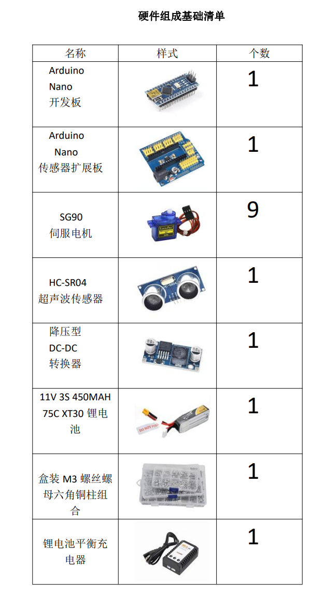

# quadrupedal-spider
Arduino controlled joint 8-servo 4-legged Walking Robot
在大创项目团队成员协助下完成；为了添加语音模块、wifi模块，后期换成其他主板提供基础
主要使用arduino和sg90舵机来控制，
- 开发语言C语言
- 开发工具arduino IDE，并配置Arduino Nano

# 选购清单

# 步骤
- 购买完零件清单(buy-bill)
- 打印3D外观建模
- 下载arduino IDE，进行烧录代码文件

这些组件和模块共同构成了一个功能丰富的智能机器人系统，可以实现语音控制、自动避障、远程监控和物联网等多种高级功能l

布线细节：按照分配的舵机编号的顺序将它们连接到数字端子。舵机编号 2 → D2 销，舵机编号 3 → D3 销：颈部舵机为 D10。HC-SR04 超声波传感器通过将 Echo 引脚连接到 D12，将 Triger 引脚连接到 D11 引脚，并将 Vcc 和 GND 连接到额外的数字引脚来供电

## finish

## Demo video
https://www.bilibili.com/video/BV1Nu4y1j7aM/?spm_id_from=333.999.0.0&vd_source=f820aa1c372379c60683b0ce117ba037
